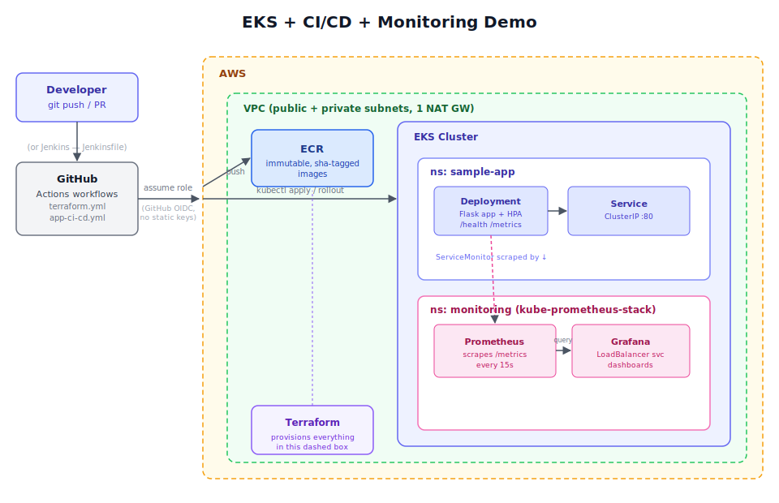

# EKS + CI/CD + Monitoring Demo

[](https://github.com/YOUR_GH_USERNAME/devops-eks-demo/actions/workflows/app-ci-cd.yml)
[](https://github.com/YOUR_GH_USERNAME/devops-eks-demo/actions/workflows/terraform.yml)
[](terraform/)
[](k8s/)
[](LICENSE)

> Replace `YOUR_GH_USERNAME` in the two workflow badge URLs above once this is
> pushed to your own GitHub account — badges only render once the workflows
> have run at least once.

An end-to-end example of the core DevOps/Cloud loop:

**Terraform provisions the infrastructure → GitHub Actions (or Jenkins)
builds/tests/deploys the app → Prometheus & Grafana watch it run.**



## What's in here

| Path | Purpose |
|---|---|
| `terraform/` | VPC, EKS cluster + managed node group, ECR repo, GitHub OIDC role, and the kube-prometheus-stack Helm release — all as code |
| `app/` | A tiny Flask service with `/health` and a Prometheus `/metrics` endpoint, plus its Dockerfile and tests |
| `k8s/` | Plain Kubernetes manifests: Namespace, Deployment, Service, HPA, ServiceMonitor |
| `.github/workflows/terraform.yml` | Plans infra changes on PRs, applies on merge to `main` |
| `.github/workflows/app-ci-cd.yml` | Tests the app, builds/pushes the image to ECR, deploys to EKS |
| `Jenkinsfile` | Same test → build/push → deploy pipeline, for teams on Jenkins instead of GitHub Actions |
| `grafana/sample-app-dashboard.json` | A starter dashboard (import into Grafana) tracking request rate, p95 latency, error rate, and pod resource usage |
| `docs/images/architecture.svg` | The diagram at the top of this README |
| `docs/bootstrap-backend.md` | One-time manual step to stand up remote Terraform state |
| `docs/jenkins-setup.md` | How to point a Jenkins job at the `Jenkinsfile` and what auth it needs |

## Why it's built this way

- **No long-lived AWS keys in CI.** GitHub Actions authenticates via OIDC
  (`terraform/github-oidc.tf` creates the trust relationship + a scoped IAM
  role), not static access keys sitting in repo secrets.
- **Infra and app deploys are separate pipelines.** A code change shouldn't
  need to touch Terraform, and infra changes shouldn't require rebuilding the
  app — mirrors how most real platform teams split responsibilities.
- **Immutable, tagged images.** ECR is configured `IMMUTABLE`, images are
  tagged with the git SHA (not `latest`), so every deploy is traceable back to
  a commit.
- **Monitoring isn't bolted on after the fact.** The `ServiceMonitor` CRD ships
  alongside the app's own manifests, and the Helm release is provisioned by
  the same Terraform run as the cluster — metrics work from the first deploy.
- **Remote state + a manual apply gate.** `terraform.yml`'s `apply` job runs
  against a `production` GitHub Environment, which you can require reviewers
  on — infra changes get a real approval step, same as the app deploy.

## Prerequisites

- An AWS account + credentials locally (for the first bootstrap run)
- Terraform >= 1.7
- `kubectl`, `helm`, `aws` CLI
- A GitHub repo to push this into (for the Actions workflows to run)

## First-time setup

> **Cost safety note:** `terraform apply` in CI is **manual-only** (see
> "Cost-safe CI" below) — nothing here can create billed AWS resources from
> an ordinary push. `plan` still runs automatically on PRs/pushes, but it's
> read-only.

```bash
# 1. (optional but recommended) stand up remote state -- see docs/bootstrap-backend.md
# 2. Provision the cluster (first time: from your own machine, your own AWS creds --
#    the CI role below doesn't exist yet, so CI can't do this part for you)
cd terraform
cp terraform.tfvars.example terraform.tfvars   # then fill in github_repo, region, etc.
terraform init
terraform apply

# 3. Point kubectl at it
aws eks update-kubeconfig --region <region> --name eks-demo-dev-cluster

# 4. Grab the CI role ARN from the apply output, put it in the repo as:
#    Settings -> Secrets and variables -> Actions -> New repository secret
#    Name: AWS_ROLE_TO_ASSUME   Value: <arn from output>

# 5. Re-apply once, passing the role, so it also gets kubectl access to the cluster:
terraform apply -var="ci_deploy_role_arn=<arn from step 4>"

# 6. From here on, infra changes go through a PR (plan runs automatically),
#    then a manual "Run workflow" click to actually apply -- see below.
#    App changes (app/**, k8s/**) still deploy automatically on push to main.
```

## Cost-safe CI: applying infra changes

`.github/workflows/terraform.yml` never runs `apply` on its own. To actually
apply an infra change after the initial bootstrap above:

1. Push your Terraform changes (a `plan` runs automatically -- read this
   first, it costs nothing).
2. Go to the repo's **Actions** tab → **Terraform (infra)** → **Run workflow**.
3. In the `confirm_apply` field, type exactly `apply`. Anything else (or
   leaving it blank) will not apply.
4. Run it. If the `production` environment has required reviewers configured
   (Settings → Environments), it'll also pause for that approval first.

## Seeing it work

```bash
# App
kubectl get pods -n sample-app
kubectl port-forward -n sample-app svc/sample-app 8080:80
curl localhost:8080/           # sample payload
curl localhost:8080/metrics    # raw Prometheus metrics

# Grafana
kubectl get svc -n monitoring kube-prometheus-stack-grafana   # find the LoadBalancer address
# log in as admin / <grafana_admin_password from tfvars>
# Dashboards -> Import -> upload grafana/sample-app-dashboard.json
```

Generate some load so the dashboard has something to show:

```bash
for i in $(seq 1 200); do curl -s localhost:8080/ > /dev/null; done
```

## Using Jenkins instead of GitHub Actions

The `Jenkinsfile` at the repo root implements the same three stages (test →
build/push → deploy) as `app-ci-cd.yml`. See `docs/jenkins-setup.md` for job
setup and the auth model (IAM instance profile/IRSA preferred over stored
credentials, matching the "no long-lived keys" approach used for GitHub
Actions). Terraform's plan/apply split isn't ported to Jenkins in this repo —
that doc explains what porting it would involve.

## Cost & teardown

This is sized to be cheap to run for a demo (single NAT gateway, `t3.medium`
nodes, 7-day metrics retention) but EKS + NAT + LoadBalancers are **not**
free. Tear it down when you're done:

```bash
cd terraform
terraform destroy
```

## Troubleshooting

**Nothing happens when I push infra changes to main** — that's expected now.
`apply` is manual-only (see "Cost-safe CI" above); a push only triggers
`plan`. Go to Actions → Terraform (infra) → Run workflow, and type `apply`.

**`apply` fails immediately with "Credentials could not be loaded"** — this
is the bootstrap chicken-and-egg problem: the IAM role the workflow tries to
assume is *created by this same Terraform config*, so it can't exist yet the
first time. Fix order:

1. Run `terraform apply` once from your own machine with your own AWS
   credentials (steps 2-3 above).
2. Copy the `github_actions_role_arn` output.
3. Add it as a **repository secret** named exactly `AWS_ROLE_TO_ASSUME`
   (Settings → Secrets and variables → Actions → Repository secrets — not a
   Variable, and not only an Environment secret unless you've also added it
   under the `production` environment).
4. Confirm `github_repo` in `terraform.tfvars` matches this exact repo
   (`org/repo`), then re-apply once more with `ci_deploy_role_arn` set so the
   role also gets `kubectl` access (step 5 above).
5. Only then should pushes to `main` succeed.

**`terraform apply` fails creating the OIDC provider ("EntityAlreadyExists")**
— your AWS account already has a GitHub OIDC provider (common if you've used
this pattern in another repo). Set `create_github_oidc_provider = false` in
`terraform.tfvars` so it reuses the existing one instead of trying to create
a duplicate.

## Things a real production version would add

- Multiple environments (dev/staging/prod) via Terraform workspaces or
  separate state files, not just one `environment` variable
- Private-only API server endpoint + VPN/bastion access
- Ingress + TLS (e.g. AWS Load Balancer Controller + cert-manager) instead of
  a `LoadBalancer` Service on Grafana
- Alertmanager routing to Slack/PagerDuty, not just Prometheus collecting data
- Policy-as-code (OPA/Conftest) gating Terraform plans in CI
- Sealed Secrets / External Secrets Operator instead of tfvars-based passwords
